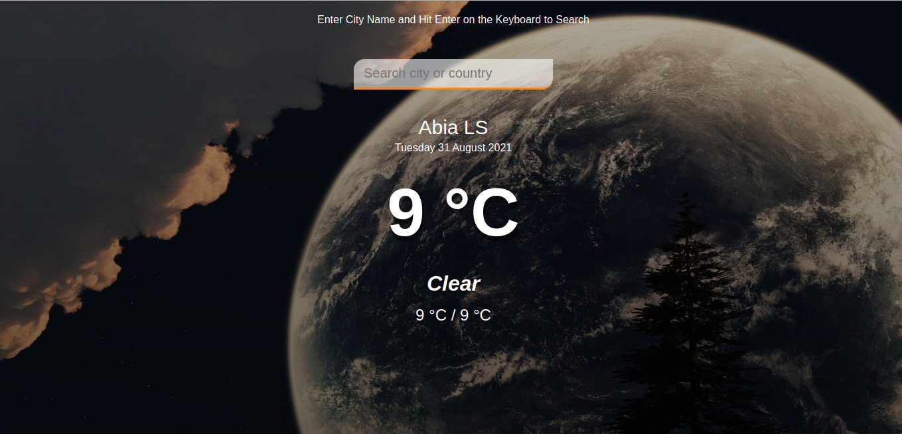

# WEATHER APP

This project is a simple weather app that shows the weather report of a chosen city in any part of the world. A user can enter the name of a city and see the weather conditions.

## Built With
- JavaScript
- Webpack
- HTML & CSS

## Getting Started
To get a copy up and running follow these simple steps:-

- Clone https://github.com/Alaska01/weatherApp.git to your local machine.
- cd into the weatherApp directory and navigate into the dist directory.
- Open the index.html file with the browser

## Usage
- Clone the project to your local machine
- Run npm install
- npm run watch

### Live Demo
- <a href="https://aye-weather.netlify.app/">Click here

## Author
 Aye Daniel Asoo

- Github: [Github](https://github.com/Alaska01)
- Twitter: [Twitter](https://twitter.com/AyeAsoo)
- E-mail: <a href="mailto:aadaniel108@gmail.com?subject=Hello Daniel!">Email</a>
- Linkedin: [Linkedin](https://www.linkedin.com/in/daniel-asoo-aye/)

## 🤝 Contributing

Contributions, issues and feature requests are welcome!

Feel free to check the [issues page](https://github.com/Alaska01/weatherApp/issues).

## Show your support

Give a ⭐️ if you like this project!

## Acknowledgments
- <a href="https://openweathermap.com">Openweather API </a>

## 📝 License

This project is MIT licensed.
